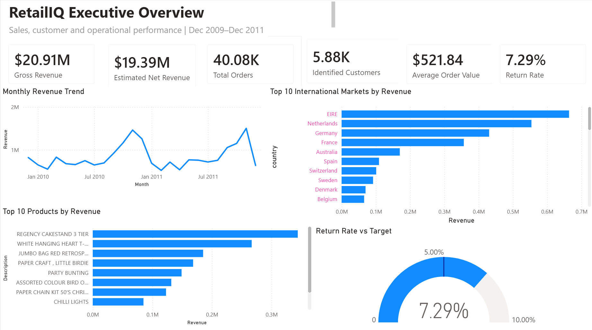
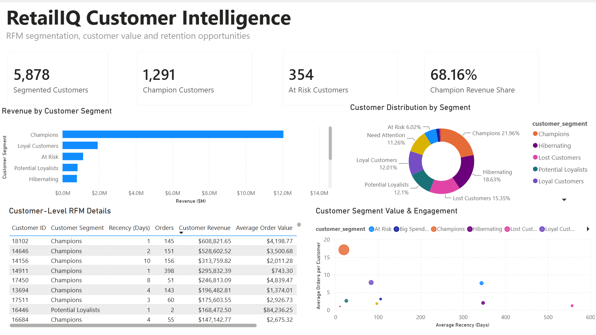
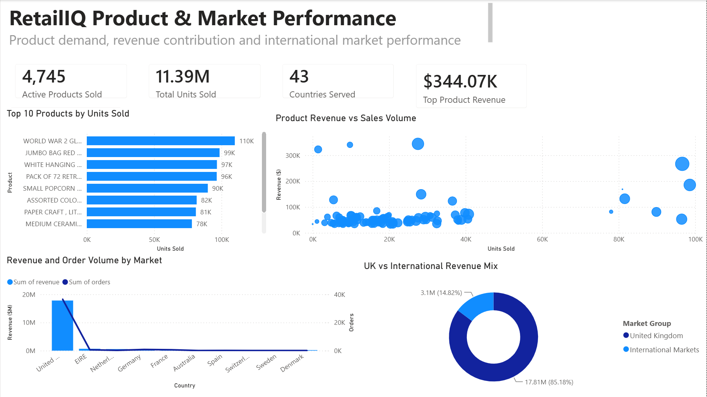

# RetailIQ: Retail Sales & Customer Intelligence Platform

## Overview

RetailIQ is an end-to-end retail analytics project that transforms more than one million e-commerce transactions into actionable insights about revenue, customers, products, returns, and geographic markets.

The project combines Python data processing, SQLite and SQL analytics, RFM customer segmentation, and a three-page Power BI dashboard.

> The Online Retail II dataset was used as the raw data source. The data-quality pipeline, warehouse design, KPI calculations, customer segmentation, and dashboards were independently developed for this project.

---

## Objectives

- Analyze revenue, orders, customers, products, and returns.
- Identify the products driving the highest revenue and unit demand.
- Segment customers based on purchasing behavior.
- Identify valuable customer groups that may be at risk.
- Compare UK and international market performance.
- Provide recommendations for retention, inventory, and market expansion.

---

## Methodology

### Data Ingestion and Validation

- Combined two Excel sheets containing **1,067,371 transaction rows**.
- Audited duplicates, missing values, cancellations, negative quantities, and invalid prices.
- Generated data-quality and cleaning reports.

### Data Cleaning and Transformation

- Removed **12,133 exact duplicate rows**.
- Classified valid sales, returns, cancellations, and data exceptions.
- Retained transactions without Customer IDs for revenue reporting.
- Excluded missing-customer records from customer-level RFM analysis.
- Created revenue, return-value, date, and transaction-status features.

### Data Modeling

Built a SQLite analytical warehouse containing:

- Customer dimension
- Product dimension
- Country dimension
- Date dimension
- Transaction fact table

Created SQL views for:

- Monthly sales
- Customer performance
- Product performance
- Country performance
- Valid sales analysis

### Customer Segmentation

RFM analysis was performed using:

- **Recency:** Days since the latest purchase
- **Frequency:** Number of distinct orders
- **Monetary:** Total customer revenue

Customers were grouped into segments such as:

- Champions
- Loyal Customers
- Potential Loyalists
- At Risk
- Hibernating
- Lost Customers

### Visualization

Developed a three-page Power BI dashboard covering:

- Executive performance
- Customer intelligence
- Product and market performance

---

## Dashboard Preview

### Executive Overview



### Customer Intelligence



### Product & Market Performance



---

## Results & Key Insights

- Analyzed **$20.91M** in gross sales revenue.
- Estimated net revenue was **$19.39M**, calculated after recorded return value.
- Analyzed **40,077 valid orders** and **11.39M units sold**.
- Identified **5,878 customers** with an average order value of **$521.84**.
- Measured a **7.29% return-value rate**.
- Found that **1,291 Champion customers generated 68.16%** of identified-customer revenue.
- Identified **354 At Risk customers** representing approximately **$1.12M** in historical revenue.
- Found that the UK generated **85.18% of total revenue**.
- International markets contributed **14.82% of total revenue**.
- Ireland, the Netherlands, Germany, and France were among the strongest international markets.
- Found that **15.44% of revenue** was associated with transactions without a Customer ID.

---

## Business Recommendations

- Launch targeted retention campaigns for At Risk customers.
- Introduce loyalty benefits for Champion customers.
- Reactivate Lost and Hibernating customers through personalized promotions.
- Prioritize inventory for consistently high-demand products.
- Review high-volume, lower-revenue products for pricing opportunities.
- Improve customer identification and transaction attribution.
- Expand marketing efforts in strong European markets.
- Investigate the causes of returns and cancellations.

---

## Key Takeaways

- Separating valid sales, returns, cancellations, and exceptions improves reporting accuracy.
- RFM segmentation converts transaction data into actionable customer-retention strategies.
- Product revenue and unit demand should be analyzed together for better pricing and inventory decisions.
- Heavy dependence on one geographic market creates business concentration risk.
- Missing customer identifiers reduce the ability to perform complete customer-level analysis.
- Clear dashboard storytelling helps technical insights support business decision-making.

---

## Tools & Technologies

- **Programming:** Python, SQL, DAX
- **Libraries:** Pandas, NumPy, OpenPyXL
- **Database:** SQLite
- **Visualization:** Power BI, Power Query
- **Development:** PyCharm, Git, GitHub

---

## Project Structure

```text
RetailIQ/
├── dashboard/
├── data/
│   ├── raw/
│   └── processed/
├── images/
├── reports/
├── sql/
├── src/
├── tests/
├── main.py
├── requirements.txt
└── README.md