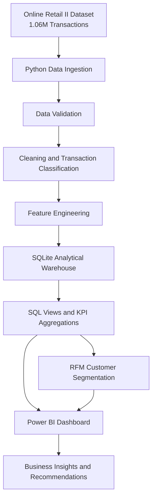

# RetailIQ Solution Architecture

```mermaid
flowchart TD
    A[Online Retail II Dataset<br/>1.06M Transactions]
    B[Python Data Ingestion]
    C[Data Validation]
    D[Cleaning and Transaction Classification]
    E[Feature Engineering]
    F[SQLite Analytical Warehouse]
    G[SQL Views and KPI Aggregations]
    H[RFM Customer Segmentation]
    I[Power BI Dashboard]
    J[Business Insights and Recommendations]

    A --> B
    B --> C
    C --> D
    D --> E
    E --> F
    F --> G
    G --> H
    G --> I
    H --> I
    I --> J
```